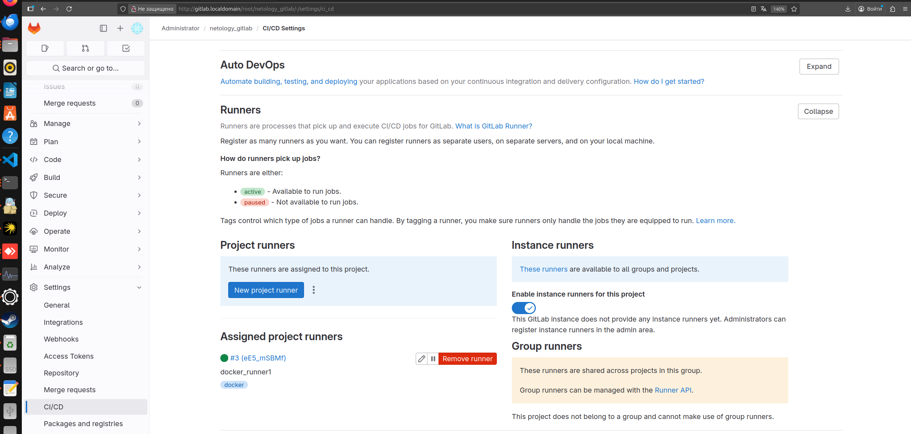
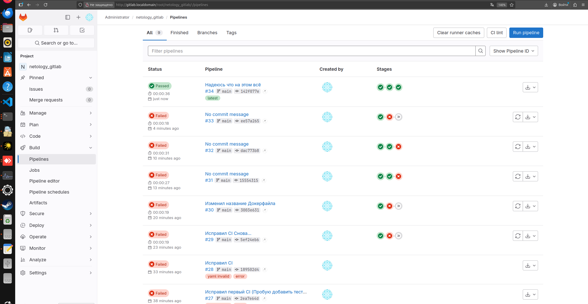
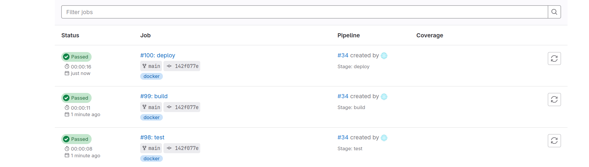
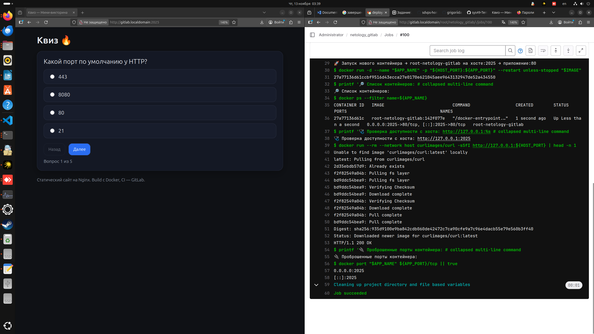
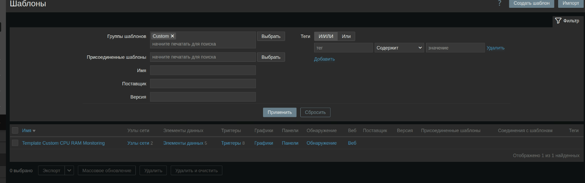
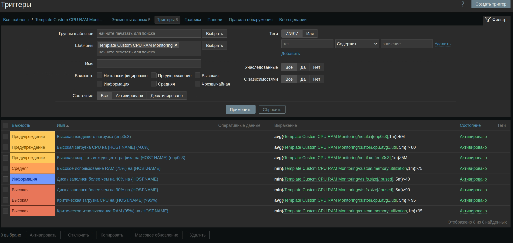

# Домашнее задание к занятию «Система мониторинга Zabbix. Часть 2» Гришин Д. А.

---
### Задание 1

#### Требования к результату
- [*] Прикрепите в файл README.md скриншот страницы шаблона с названием «Задание 1»
    

 ---

### Задание 2
Добавьте в Zabbix два хоста и задайте им имена <фамилия и инициалы-1> и <фамилия и инициалы-2>. Например: ivanovii-1 и ivanovii-2.
#### Требования к результату
- [*] Результат данного задания сдавайте вместе с заданием 3

 ---

### Задание 3
Привяжите созданный шаблон к двум хостам. Также привяжите к обоим хостам шаблон Linux by Zabbix Agent.
# Configuration > Hosts

# Monitoring > Latest data

# Items

# Triggers

#### Требования к результату
- [*] Прикрепите в файл README.md скриншот страницы хостов, где будут видны привязки шаблонов с названиями «Задание 2-3». Хосты должны иметь зелёный статус подключения

 ---

### Задание 4
Создайте свой кастомный дашборд.
# Кастомный Дашборд

 ---
