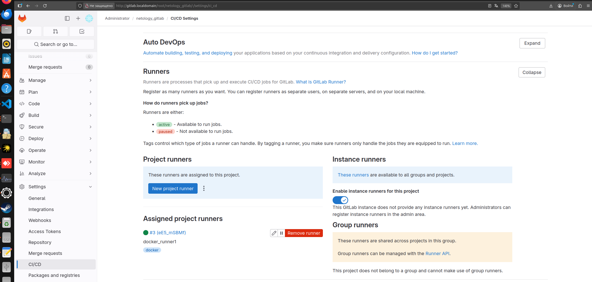
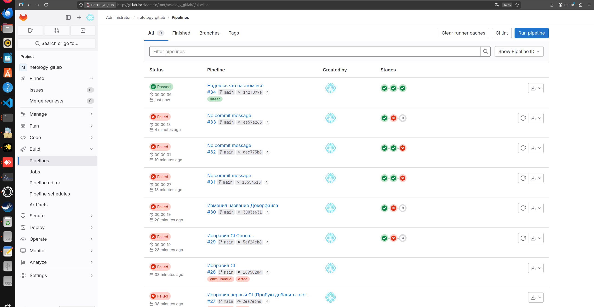
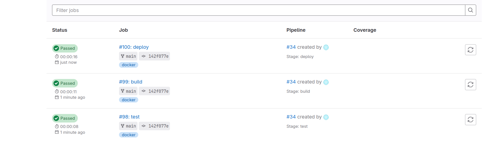
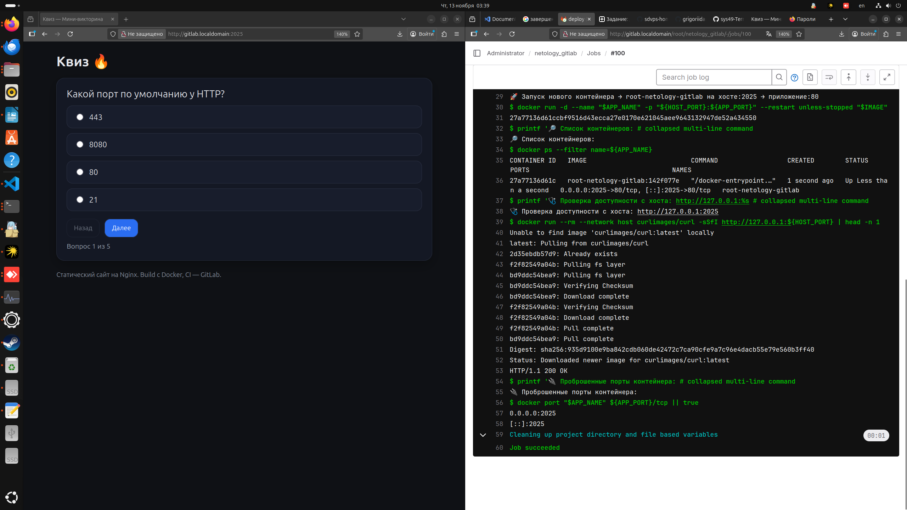

# Домашнее задание к занятию "`GITLAB`" - `Гришин Даниил`

# Задание 1

Что нужно сделать:

    Разверните GitLab локально, используя Vagrantfile и инструкцию, описанные в этом репозитории.
    Создайте новый проект и пустой репозиторий в нём.
    Зарегистрируйте gitlab-runner для этого проекта и запустите его в режиме Docker. Раннер можно регистрировать и запускать на той же виртуальной машине, на которой запущен GitLab.

В качестве ответа в репозиторий шаблона с решением добавьте скриншоты с настройками раннера в проекте.
# Задание 2

Что нужно сделать:

    Запушьте репозиторий на GitLab, изменив origin. Это изучалось на занятии по Git.
    Создайте .gitlab-ci.yml, описав в нём все необходимые, на ваш взгляд, этапы.

В качестве ответа в шаблон с решением добавьте:

    файл gitlab-ci.yml для своего проекта или вставьте код в соответствующее поле в шаблоне;
    скриншоты с успешно собранными сборками.

# Задание 1

# Задание 2

# Просто Эксперимент

# Заключение
Здравствуйте. Я задержал ДЗ 8.3, потому что сначала делал через схему Win → VM Ubuntu → Vagrant/VirtualBox с GitLab. Вложенная виртуализация ломала запуск: vagrant ssh в таймаут, GitLab еле грузился и падал. Поднимал RAM/CPU — не спасло. В итоге поставил отдельную Ubuntu — так GitLab и runner в Docker работают стабильно.